# Basic CI/CD
## Part 1. Настройка gitlab-runner

* Подними виртуальную машину Ubuntu Server 22.04 LTS.

> docker pull ubuntu

> docker run -it ubuntu

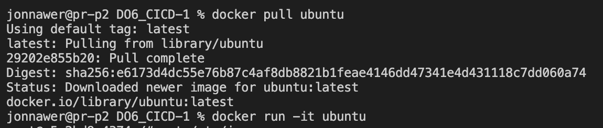

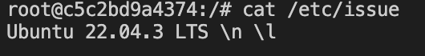

* Скачай и установи на виртуальную машину gitlab-runner.

Сначала обновляем, устанавливаем нужные утилиты:

> apt-get update 

> apt-get upgrade 

> apt-get install curl

> apt-get install gcc

> apt-get install make

> apt-get install clang-format

Устанавливаем gitlab-runner:
> curl -L "https://packages.gitlab.com/install/repositories/runner/gitlab-runner/script.deb.sh" | bash

> apt-get install gitlab-runner

* Запусти gitlab-runner и зарегистрируй его для использования в текущем проекте (DO6_CICD).

Регистрация:

> gitlab-runner register

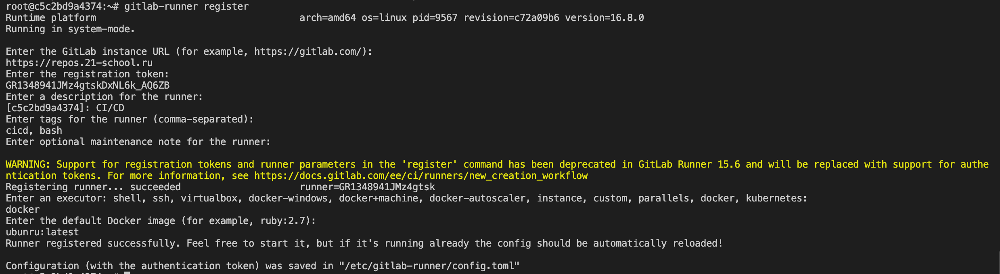

1) coordinator URL - URL (на страничке задания на платформе)
2) token - Регистрационный токен (на страничке задания на платформе)
3) description - Описание для данного Runner
4) tags - Теги (можно ввести несколько через запятую)
5) Техническая информация — maintenance note — можно задать информацию для других разработчиков
6) executor — среда, в которой будут запускаться pipeline

PS: Если не включается gitlab-runner (проверка с помощью комнады gitlab-runner status || service gitlab-runner status), измени файл __/etc/init.d/gitlab-runner__ :

```
...
DAEMON="/usr/bin/gitlab-runner"
DESC="GitLab Runner"
USER="gitlab-runner"
...
--exec "$DAEMON" --  "run" "--working-directory" "/var/lib/gitlab-runner" "--config" "/etc/gitlab-runner/config.toml" "--service" "gitlab-runner" "--syslog" "--user" "$USER"
...
```

## Part 2. Сборка

* Напиши этап для CI по сборке приложений из проекта C2_SimpleBashUtils.
* В файле gitlab-ci.yml добавь этап запуска сборки через мейк файл из проекта C2.
* Файлы, полученные после сборки (артефакты), сохрани в произвольную директорию со сроком хранения 30 дней.

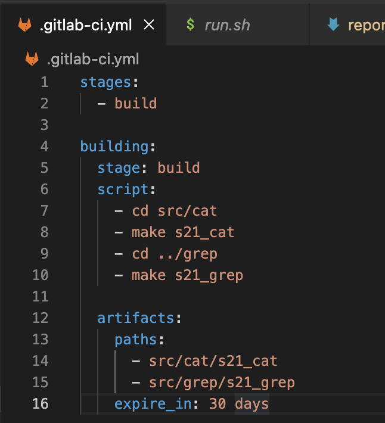

Пушим файлы и проверяем gitlab:

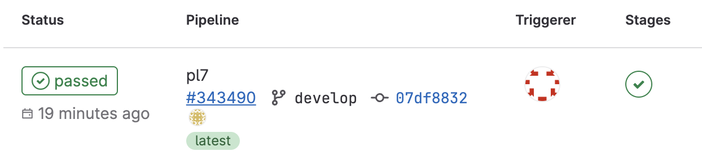

## Part 3. Тест кодстайла

* Напиши этап для CI, который запускает скрипт кодстайла (clang-format). Если кодстайл не прошел, то «зафейли» пайплайн. В пайплайне отобрази вывод утилиты clang-format.

В файл gitlab-ci.yml добавляем этап проверки кодстайла:

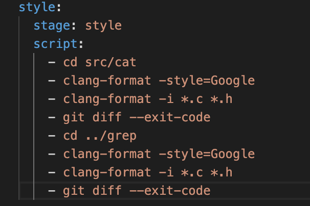

Пушим файлы и проверяем gitlab:


## Part 4. Интеграционные тесты

* Напиши этап для CI, который запускает твои интеграционные тесты из того же проекта. Запусти этот этап автоматически только при условии, если сборка и тест кодстайла прошли успешно. Если тесты не прошли, то «зафейли» пайплайн.

В файл gitlab-ci.yml добавляем этап тестирования. Он запускается после успешной сборки и прохождения кодстайла, в случае неудачи - скипается и пайплайн фейлится.

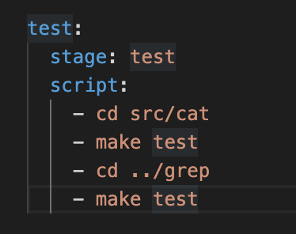

Фейлится на стадии проверки кодстайла:

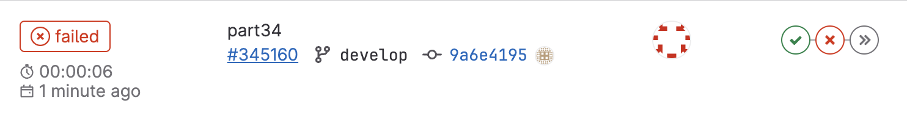

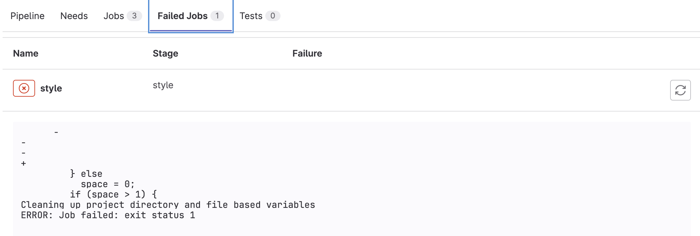

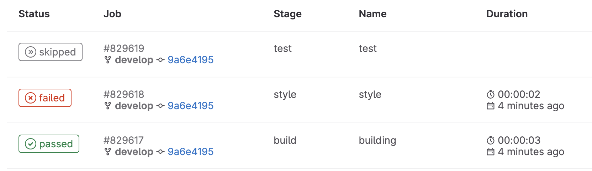

Проходит успешно:


В файл автотестов проекта добавляем:


В случае если интеграционные тесты провалились, пайплан фейлится: 

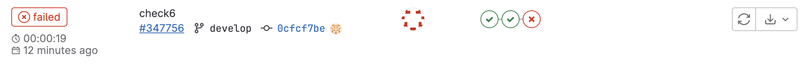

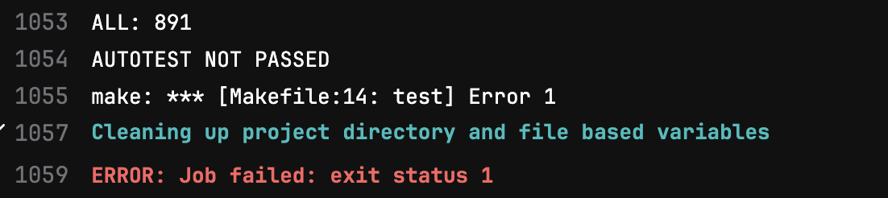

В случае если интеграционные тесты успешно прошли: 

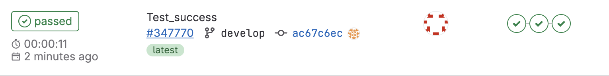

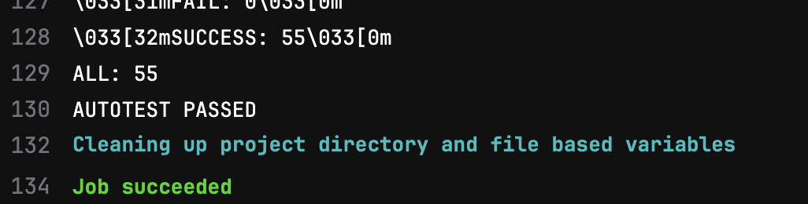

## Part 5. Этап деплоя

* Подними вторую виртуальную машину Ubuntu Server 22.04 LTS.

Напиши этап для CD, который «разворачивает» проект на другой виртуальной машине.

Запусти этот этап вручную при условии, что все предыдущие этапы прошли успешно.

Напиши bash-скрипт, который при помощи ssh и scp копирует файлы, полученные после сборки (артефакты), в директорию /usr/local/bin второй виртуальной машины. Будь готов объяснить по скрипту, как происходит перенос.

В файле gitlab-ci.yml добавь этап запуска написанного скрипта. В случае ошибки «зафейли» пайплайн.
В результате ты должен получить готовые к работе приложения из проекта C2_SimpleBashUtils (s21_cat и s21_grep) на второй виртуальной машине.

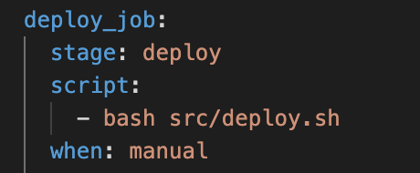

В докере контейнеры находятся в одной подсети, поэтому достаточно настройки ssh. Устанавливаем и включаем ssh на обеих машинах:

> apt-get install openssh-server

> service ssh start

На второй машине добавляем нового пользователя с паролем, переключаемся на него (su user). 

Через root даем права на папку:

> chmod 777 /usr/local/bin/

_Для переключения на root-пользователя (и между пользователями) необходимо наличие пароля. На всякий случай добавила свои Докерфайлы сборки образа._

На первой машине переключаемся на пользователя gitlab-runner (su gitlab-runner).
Генерируем новый ssh-ключ для второй машины командой ssh-keygen:

> ssh-keygen -t rsa -b 2048

Копируем ключ, указывая адрес и пользователя второй машины:

> ssh-copy-id user@172.17.0.3


После успешного прохождения этапов сборки, стиля и теста, стадия деплоя ждет ручного запуска:

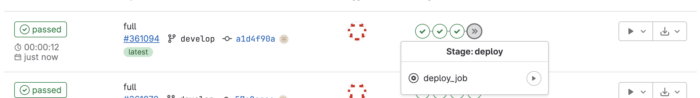

Запускаем, деплой проходит успешно:

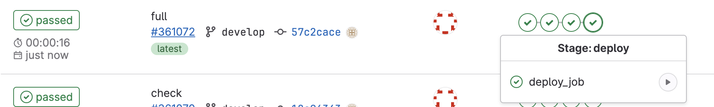

Файлы появились на второй машине:

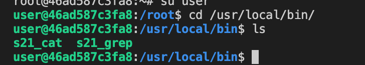


## Part 6. Дополнительно. Уведомления

* Настрой уведомления о успешном/неуспешном выполнении пайплайна через бота с именем «[твой nickname] DO6 CI/CD» в Telegram.

Текст уведомления должен содержать информацию об успешности прохождения как этапа CI, так и этапа CD. В остальном текст уведомления может быть произвольным.

Создаем файл `telegram_bot.sh`. К каждому этапу добавляем скрипт:

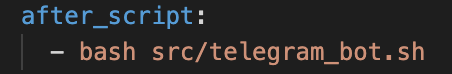

Переходим в телеграме в @botfather, создаем бота с именем. API вставляем в `telegram_bot.sh`:


Переходим в телеграме в @userinfobot. Находим ID, указываем в `telegram_bot.sh`:

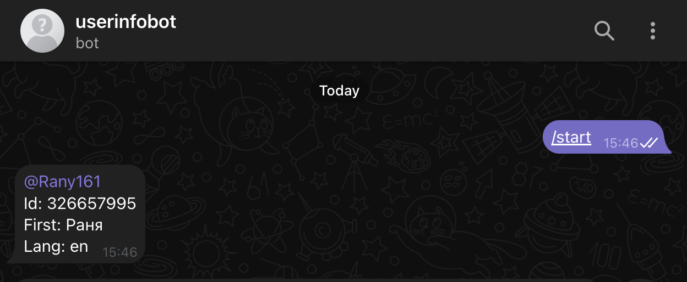

Уведомления о успешном/неуспешном выполнении пайплайна:

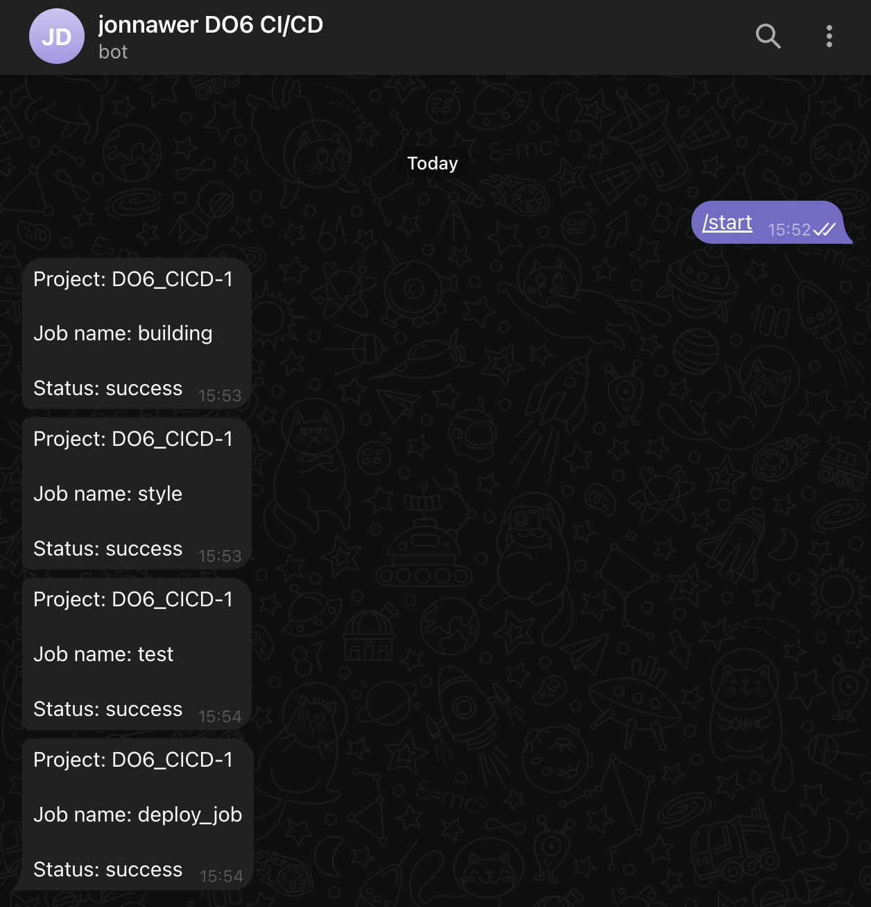
